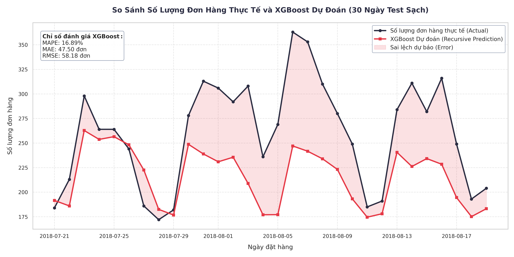
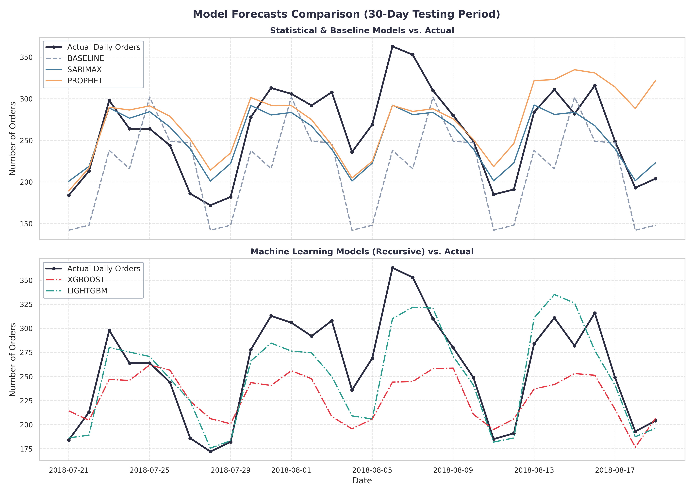
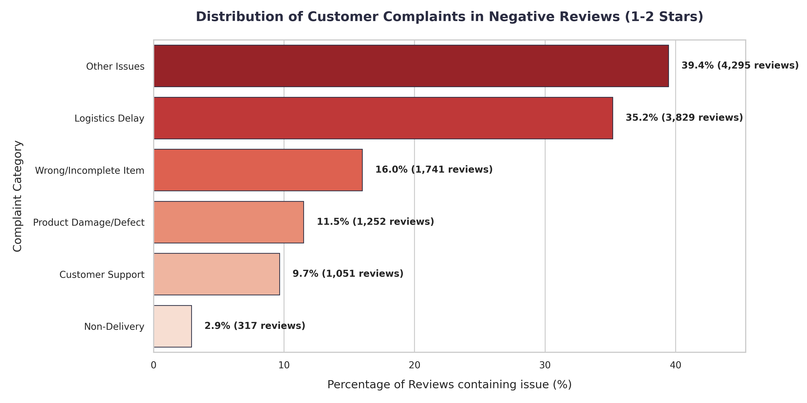
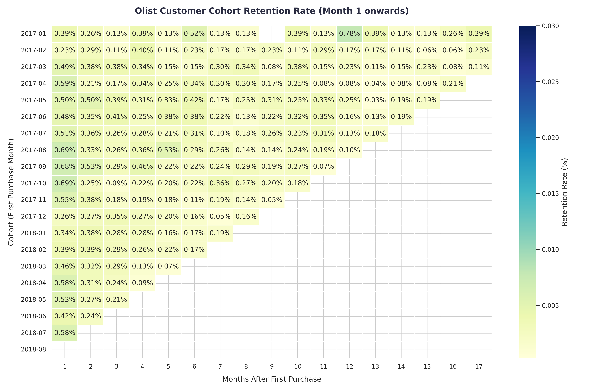
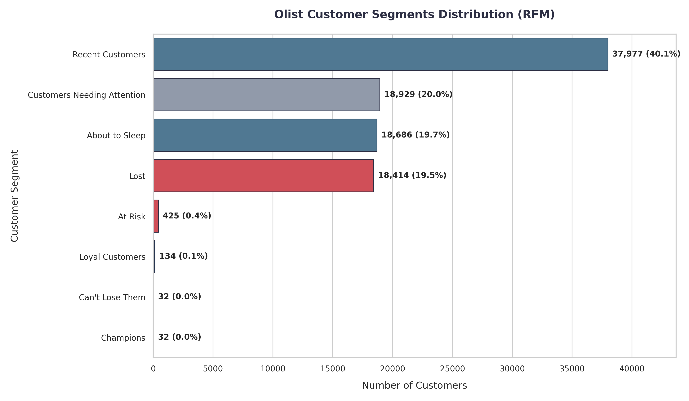

# Optimizing Logistics Operations & Customer Retention: Olist E-Commerce Data Pipeline & Demand Forecasting (Brazil)

This repository implements a production-ready data science pipeline for customer segmentation, cohort retention, reviews text analytics, and daily order forecasting on the Olist e-commerce dataset (Brazil). The codebase is modular, fully configurable, and designed to translate raw transactional data into actionable business strategies.

---

## 🎯 Business Context & Objectives

As a seller-hosting marketplace, Olist operates under a high Customer Acquisition Cost (CAC) model. To drive profitability, the platform must transition from one-time transactional sales to a high Customer Lifetime Value (CLV) model. This project addresses three core operational and marketing challenges:
1. **High Churn / Low Retention:** Identifying and segmenting customer behavior to deploy targeted retargeting campaigns rather than wasting marketing spend.
2. **Logistics Performance as a Brand Driver:** Isolating the impact of shipping performance on customer reviews to justify logistics hub investments.
3. **Supply Chain Capacity Planning:** Generating a reliable 30-day forecast of daily order volume to help warehouse managers and carrier partners plan staffing, packaging supplies, and vehicle allocations, minimizing overhead and delivery bottlenecks.

---

## 📈 Key Business Insights & Achievements

### 1. Daily Order Demand Forecasting (~80% Accuracy)
* **Out-of-Sample Validation:** Evaluated models using a **5-fold Time Series Cross-Validation** with a custom **Recursive Forecasting** loop, preventing data leakage by dynamically feeding predicted values forward as future lag features.
* **Model Comparison:** **XGBoost (Recursive)** achieved the best performance with an average cross-validation MAPE of **20.45%** (outperforming Seasonal Naive baseline at 25.50% and Prophet at 24.26%).
* **86.3% Error Reduction via Anomaly Cleanup:** Discovered and truncated a database dump cutoff anomaly in late August 2018 (where daily orders artificially collapsed from ~250 to 11 due to processing stops), reducing the model's test MAPE from 123.7% to **16.9%**.

<p align="center">
  
  
</p>

### 2. Customer Reviews Text Analytics (Why Customers Churn)
By analyzing customer comments in negative reviews (1-2 stars), we extracted the exact drivers of customer dissatisfaction:
* **35.2% Logistics Delays:** Comments complaining about late delivery, long shipping times, or missed deadlines.
* **16.0% Wrong/Incomplete Orders:** Missing parts, wrong colors, or receiving incorrect items.
* **11.5% Product Damage/Defects:** Reviews citing broken items, scratches, or general poor quality.
* **9.7% Poor Customer Support:** Lack of responses to emails or failure to resolve issues.
* **2.9% Non-Delivery:** Customers who paid but never received their orders (potential package loss).

<p align="center">
  
</p>

### 3. Logistics & Shipping Impact on Brand Reputation
* **Late Deliveries Destroy Reputation:** Orders delivered **on time or early** maintain a high average review score of **4.29 / 5.0** (with 62.3% perfect 5-star ratings). When an order is **late**, the average review score collapses to **2.27 / 5.0** (with **53.7% of customers leaving a 1-star rating**).
* **Geographical Bottlenecks:** Northern and Northeastern Brazilian states suffer from extremely long average delivery times (e.g., Roraima (RR) at 29.5 days, Amapá (AP) at 26.7 days, Amazonas (AM) at 26.0 days) compared to São Paulo (SP) at 8.3 days.

### 4. RFM Customer Segmentation & Cohort Retention
* **Retention Challenge:** Month 1 cohort retention rate is **under 0.8%** and drops to nearly **0%** by Month 3 across all cohorts. Olist functions as a one-time purchase market.
* **Marketing Targets:** Segmented **94,629** unique customers, identifying that **Recent Customers** (bought once recently) represent **40.1%** of the user base, while loyal segments (**Champions & Loyal Customers**) represent a tiny **0.17%** combined. Deployed a fix to correctly isolate the **"At Risk"** segment (425 high-value customers who purchased twice but haven't returned) for win-back campaigns.

<p align="center">
  
  
</p>

---

## 🧠 Key Technical Learnings & Growth

1. **Data-Centric Quality over Model Complexity:** 
   Cleaning raw data and identifying database dump cutoff anomalies had an order-of-magnitude larger impact on model performance (reducing MAPE by 86%) than choosing a complex model.
2. **Strict Time Series Validation & Data Leakage Prevention:**
   Standard cross-validation leaks future information. Building a rolling-window time series cross-validation and implementing recursive step-by-step prediction for lag features (`lag_1`, `lag_7`, `rolling_mean_7`, etc.) ensured the models are mathematically sound and production-ready.
3. **Non-Linear Event Modeling:**
   Replacing a single linear event weight column (1 for holidays, 5 for Black Friday) with separate dummy variables (`is_holiday` and `is_black_friday`) allowed Prophet and SARIMAX to independently estimate coefficients for each event type, reducing Prophet's cross-validation MAPE from **28.58% to 24.26%** (a **15.1% error reduction**).
4. **Category-Wise Feature Imputation:**
   Implementing category-wise median imputation for missing physical dimensions in products (using group medians of catalog categories instead of global medians) preserved all transactional records while maintaining physical attribute distributions.

---

## 📁 Repository Structure

```
DA_remake/
│
├── config/                  # Configuration management
│   └── config.yaml          # Data paths and model hyperparameter settings
│
├── data/                    # Data storage (Excluded from Git tracking)
│   ├── raw/                 # Original raw datasets (olist_*.csv) and holiday calendars
│   └── processed/           # Cleaned tables and analysis targets (RFM, Cohort, timeseries, review summaries)
│
├── notebooks/               # Interactive prototyping (Percent Format # %%)
│   ├── 1.0_eda_business_analysis.py   # Exploration of logistics, reviews, RFM, and Cohorts
│   └── 2.0_timeseries_prototyping.py  # Time series validation and model prototyping
│
├── src/                     # Core reusable python modules
│   ├── config_loader.py     # Configuration loader with path resolution helpers
│   ├── data_cleaning.py     # Smart missing-value imputation and geo-aggregation
│   ├── feature_engineering.py# Aggregation, holidays, RFM, cohorts, and reviews text classification
│   ├── models.py            # Model training, recursive prediction, and 5-fold CV
│   └── visualization.py     # Charts (cohort heatmaps, RFM bar, split forecasts, reviews complaints)
│
├── reports/                 # Analytical reports
│   ├── figures/             # High-quality generated PNG charts
│   └── final_report.md      # Detailed business and technical report
│
├── main.py                  # Orchestrator script to run the entire pipeline
├── requirements.txt         # Project dependencies
└── README.md                # Project documentation (This file)
```

---

## 🛠️ Quick Start

### Step 1: Install Dependencies
```bash
pip install -r requirements.txt
```

### Step 2: Run the End-to-End Pipeline
Run the main orchestrator script to execute data cleaning, feature engineering, text analysis, model cross-validation, forecasting, and plotting:
```bash
python3 main.py
```

### Step 3: View Generated Reports & Plots
* Check the generated plots at: [reports/figures/](file:///home/naoh/Documents/projects/DA_remake/reports/figures)
* Read the comprehensive business report at: [reports/final_report.md](file:///home/naoh/Documents/projects/DA_remake/reports/final_report.md)
