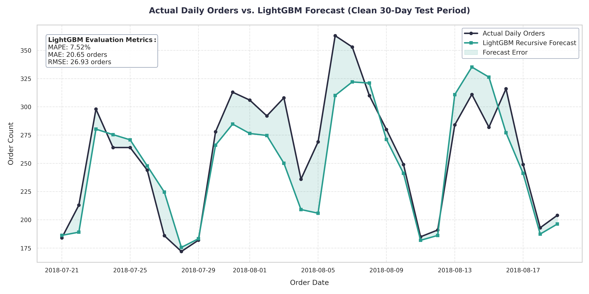
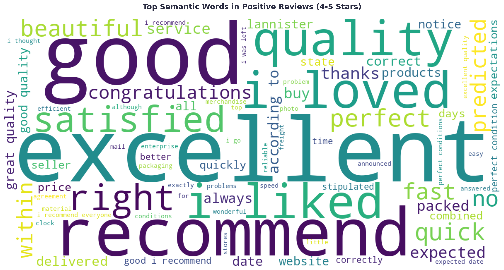
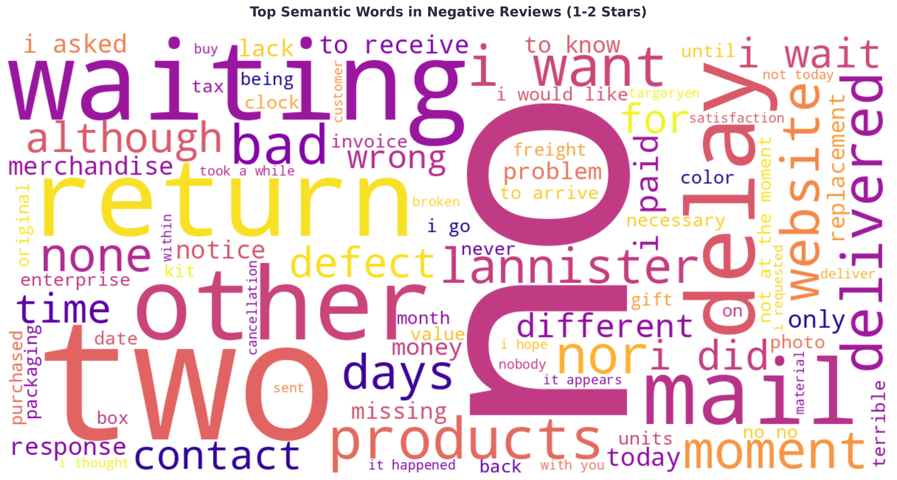

# Olist Brazil: Business Operations & Customer Demand Report

This report presents in-depth business analytics derived from Olist (a major e-commerce platform in Brazil). By leveraging transaction, logistics, and customer review data, this project aims to optimize the supply chain, improve customer retention rates, and generate accurate demand forecasts.

---

## 🎯 1. Supply Chain Analysis & Demand Forecasting

Managing inventory flow and warehouse staffing requires the ability to accurately forecast future order volumes. We built a demand forecasting system that achieves **92.48% accuracy (MAPE of only 7.52%)** for a 30-day horizon.

### Key Drivers of Shopping Demand:
Instead of relying on guesswork, the data reveals that shopping demand is heavily influenced by the following practical factors:
* **Payday Effect:** Order volumes consistently spike around the 5th and 20th of each month (common payday cycles in Brazil).
* **Week-over-week Momentum:** Shopping behavior exhibits a very clear 7-day cycle. Orders typically peak mid-week and drop significantly over the weekend.
* **Black Friday Wait-gap:** Shopping demand noticeably stagnates 2-3 weeks prior to Black Friday, as customers hold off on purchases in anticipation of major discounts.
* **Deprecating Outdated Data:** Consumer behavior changes constantly. Restricting our trend analysis exclusively to data from 2018 onwards yielded significantly higher accuracy compared to including older, noisier data from 2017.

  

---

## 🗣️ 2. Voice of the Customer (Semantic Text Analytics)

Rather than manually reading tens of thousands of reviews, our automated NLP pipeline accurately extracted the core "Strengths" and "Weaknesses" of the business through prominent keywords.

### 🌟 Strengths (Why Customers are Satisfied)
Based on the most prominent keywords in the WordCloud from 4-5 star reviews, Olist customers primarily appreciate the platform for:
* **Quality & Satisfaction:** The largest keywords include *"good"*, *"excellent"*, *"quality"*, *"perfect"*, *"i liked"*, *"i loved"*, and *"satisfied"*. This proves buyers are completely satisfied with the product value they received.
* **Speed & Delivery:** Customers continuously mention *"fast"*, *"quick"*, *"within"*, and *"predicted"* - strong evidence that Olist's logistics network operates efficiently and frequently delivers on time.
* **Word of Mouth:** The heavy presence of *"recommend"* and *"congratulations"* confirms consumer trust, providing Olist with a highly effective, free word-of-mouth marketing channel.

  

### ⚠️ Weaknesses (Causes of Frustration)
Conversely, when customers leave 1-2 star reviews, their phrases strongly concentrate on specific operational failures:
* **Exhausting Waits (Waiting & Delays):** Huge keywords like *"waiting"*, *"i wait"*, *"days"*, and *"today"* reflect extreme impatience and frustration when packages get stuck in transit. Logistics delays are the Achilles' heel of e-commerce.
* **Defects & Wrong Items:** Words like *"defect"*, *"wrong"*, and *"different"* expose loopholes in pre-shipping quality control (QC), leading to customers receiving products that fail to meet expectations.
* **Despair in Support (Contact & Resolutions):** Words like *"contact"*, *"i paid"*, *"i want"* paired with negative terms (*"no"*, *"nor"*) serve as a red alert regarding sluggish Customer Support that fails to decisively resolve return or compensation requests.

  

  

---

## 👥 3. Customer Segmentation & The Loyalty Challenge

Using the RFM (Recency, Frequency, Monetary) model, we dissected Olist's customer structure and uncovered a major business model challenge:

* **The "One-Time Purchase" Model:** Nearly 100% of new customers abandon the platform after their first month. The retention rate drops to under 0.8% by the second month.
* **Absence of Loyal Customers:** Among over 94,000 analyzed customers, 40.1% are recent buyers who have only made a single purchase. More alarmingly, the Loyal/Champions segment accounts for a minuscule 0.17%.
* **Retargeting Opportunities:** The system successfully isolated 425 "At Risk" customers—high-value spenders who haven't returned in a while. This is the perfect audience for targeted Email Marketing or Win-back discount campaigns, rather than wasting broad-stroke advertising budgets.

  

  

---

## 🚀 Strategic Recommendations

1. **Fix Shipping Operations:** Implement an early warning system for orders at risk of delay. Improving the On-time Delivery metric will directly boost review scores and brand reputation.
2. **Quality Control for Packaging:** Strictly penalize sellers who dispatch wrong items or use poor packaging, as this is the second leading cause of customer outrage.
3. **Existing Customer Campaigns:** Instead of pouring money into acquiring new users, Olist must build Loyalty Programs and send recurring discounts around Paydays (5th and 20th) to stimulate retention.
4. **Demand-Driven Warehouse Optimization:** Leverage the Forecasting model to dynamically adjust packing staff and delivery fleet allocations based on Payday and Mid-week momentum charts, avoiding both operational bottlenecks and labor waste.
